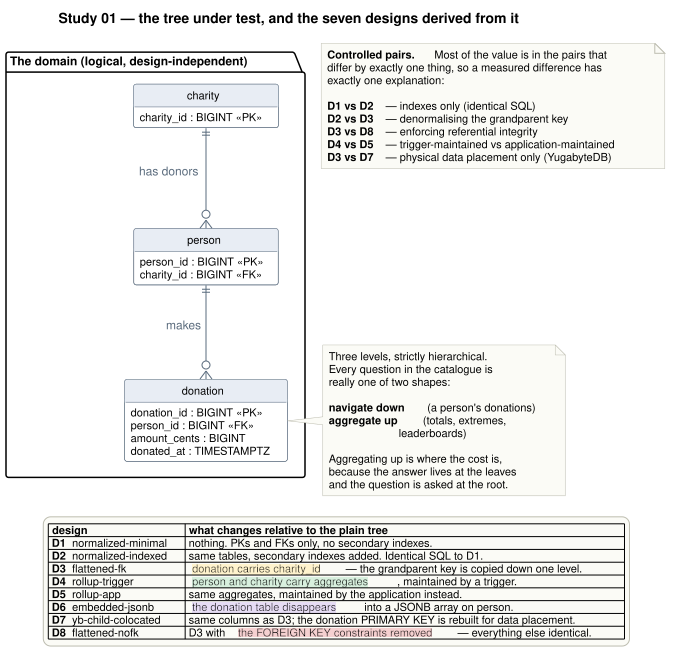

# Study 01 — Tree structures: charity → person → donation

**Status:** active
**Environment:** [`host-zenbook-ux5406sa`](../../docs/environments/host-zenbook-ux5406sa.md)
**Engines:** PostgreSQL 17.11 · YugabyteDB 2025.2.6.0 (1 node and 3 nodes, RF=3)

## v4 in planning — "who donated last in a period"

The owner asked on 2026-09-15 for the question *"which people made their LAST donation
last week (or another period)"*, and offered a candidate design: a `last_donation` flag on
`donation`, indexed. [`RECENCY.md`](RECENCY.md) is the protocol that answers it — the
exact semantics (two window regimes, and why the cheap answer is right in one and wrong in
the other), seven new designs including the owner's flag and its unguarded negative
control, the controlled pairs, the correctness gate and audit, the experiments and the
limitations. No result exists yet; implementation is
[EH-02](../../docs/handoffs/20260915-recency-and-reports/HANDOFF.md).

## v3 follow-ups

The local follow-ups are complete at `study-01/v3-enhancements`:
[read the concise final analysis](reports/analyses/20260914-study01-v3--gpt-6--2026-09-14.md),
then follow the [detailed design and analyst discussions](reports/discussions/README.md).
Real-network and physical-host failure validation still requires independent hosts.

The [enhancement protocol](ENHANCEMENTS.md) adds independently loaded trials, controlled
D11–D17 variants, growth cycles, fixed-reader scheduled writes, YugabyteDB correctness
and FK follow-ups, and an equal-total-resource comparison. Use Git Bash on Windows:

```bash
./run-study.sh --suite enhancements --experiments verify --trials 1 --tag
./run-study.sh --suite enhancements --experiments reads,mechanisms --trials 5 --tag
./run-study.sh --suite enhancements --experiments growth,contention,exceptions,deployment --trials 3 --tag
./run-study.sh --suite enhancements --experiments memory-control --trials 3 --tag
```

Each command uses the machine-wide benchmark lock, pins an immutable image ID, records
the committed source and creates a run tag. Database containers must not already exist.
The default full suite is long; each group can run separately. Read trials use 8 workers,
3 s per query after 1 s discarded warmup; longer write and arrival windows are explicit
in `results/<run>/ordered-cells.tsv`. Every reported trial reloads from the same seed.
The memory-control group repeats D3/D6 at both 256 MiB and 3 GiB, holding the
medium/history-multiplier=2 dataset and all mutation counts fixed.

The generated `reports/<run>.md` keeps all trials. Signed final analyses remain concise;
SQL/plan explanations and exchanges between analysts go in `reports/discussions/`.

| Variant | Controlled change |
|---|---|
| D11 copied key | D2 queries/indexes with D3 row shape and its additional charity FK |
| D12 recency index | D11 plus `(charity_id, donated_at DESC)` |
| D13 recency SQL | D12 plus q02/q05/q12 rewrites |
| D17 sum SQL | D13 plus q08 rewrite, same indexes |
| D14 plain sum index | D17 plus plain `(charity_id)` index |
| D15 covering sum index | D14 with `INCLUDE (amount_cents)`; D3 adds only ranking rewrites |
| D16 sum rollup | D3 plus sums on both parents; all other queries still derive their answers |

---

## The question

A charity system is a three-level tree:

```
charity ──< person ──< donation
```

Every interesting question about it is one of two shapes:

- **navigate down** — "show me this donor's recent gifts"
- **aggregate up** — "who gives the most", "what is the total", "when was the last one"

Navigating down is easy; the key you have points at the rows you want. **Aggregating up
is where the cost is**, because the answer lives in the leaves and the question is asked
at the root. Every design in this study is a different answer to *when* you pay for that
aggregation — at read time, at write time, or never.

### Questions the study answers

| # | Question |
|---|---|
| q01 | Information of the last donation (globally) |
| q02 | Information of the last donation (one charity) |
| q03 | Who is the person that donates the most |
| q04 | Top-10 donor leaderboard |
| q05 | Who was the last person that donated |
| q06 | When was the first and last donation of a person |
| q07 | How much money was donated in total |
| q08 | How much was donated to one charity |
| q09 | A person's 20 most recent donations *(the highest-QPS query in a real system)* |
| q10 | Donation by id — point lookup *(the control)* |
| q11 | How many donations a person made |
| q12 | Charity activity feed — last 50 donations with donor names |

### Writes the study measures

Reads span all three tables — and *which* table answers a question is itself the design
variable (D1 answers "total donated" from `donation`; D4 answers it from `charity`).
Writes are split by where they **originate**:

| Operation | Originates at | Why it is here |
|---|---|---|
| insert donation | child | the hot path; dominates real volume |
| correct a donation amount | child | forces rollups to adjust a stored sum |
| remove one donation | child | a MIN/MAX cannot be decremented, so rollups must recompute |
| **donor edits their profile** | **parent** | touches no child data — but D6 has made the person row *contain* the history |
| **erase a donor and all donations** | **parent** | same outcome everywhere, wildly different work: N child deletes vs one row |

The two parent-originating operations matter because without them `person` and `charity`
are only ever written as *side effects* (a trigger, an app rollup, an embedded array) — and
that hides costs which fall specifically on the embedded and rollup designs.

Deliberately out of scope, at the study owner's request: anything requiring materialised
views or time-bucketed tables ("how much between two dates"). The point here is the
*shape of the tree*, not pre-aggregation pipelines.

---

## The designs



| ID | Design | One-line change |
|---|---|---|
| **D1** | [normalized-minimal](diagrams/rendered/d1_normalized_minimal.svg) | Textbook 3NF. PKs and FKs only, **no secondary indexes**. |
| **D2** | [normalized-indexed](diagrams/rendered/d2_normalized_indexed.svg) | D1 + secondary indexes. **Byte-identical SQL to D1.** |
| **D3** | [flattened-fk](diagrams/rendered/d3_flattened_fk.svg) | D2 + `charity_id` denormalised onto `donation`. |
| **D8** | [flattened-nofk](diagrams/rendered/d8_flattened_nofk.svg) | D3 **minus the FOREIGN KEY constraints**. Otherwise identical. |
| **D4** | [rollup-trigger](diagrams/rendered/d4_rollup_trigger.svg) | D3 + aggregates on `person`/`charity`, maintained by **triggers**. |
| **D5** | [rollup-app](diagrams/rendered/d5_rollup_app.svg) | Same columns as D4, maintained by the **application**. |
| **D6** | [embedded-jsonb](diagrams/rendered/d6_embedded_jsonb.svg) | The **whole** `donation` table **folded into `person`** as a JSONB array. |
| **D9** | [embedded-hybrid](diagrams/rendered/d9_embedded_hybrid.svg) | A **bounded** 20-element newest-first cache on `person`; the table stays. |
| **D10** | [embedded-hybrid-locked](diagrams/rendered/d10_embedded_hybrid_locked.svg) | D9 with a **concurrency-correct** cache trigger. D9's original trigger silently corrupted caches under concurrent writes. |
| **D7** | [yb-child-colocated](diagrams/rendered/d7_yb_child_colocated.svg) | D3's columns; donation's **PRIMARY KEY rebuilt for data placement**. YugabyteDB only. |

D6 and D9 are the two ends of the embedding question. D6 takes it to its conclusion and
meets unbounded write amplification: appending one donation rewrites a document that grows
with the donor's entire history, so the cost of a write is O(history). D9 caps the array at
20, which makes that rewrite a constant, and keeps the real `donation` table underneath as
the source of truth — buying the single query that matters most in production (*"this
donor's recent gifts"*) without paying D6's collapse on everything else.

The SQL for each lives in [`sql/<design>/`](sql/) as four readable files — `schema.sql`,
`indexes.sql`, `queries.sql`, `writes.sql` (plus `triggers.sql` for D4). Those files are
compiled into the benchmark binary with `go:embed`, so the SQL that produced a result is
guaranteed to be the SQL sitting next to it in the repository.

### Controlled pairs

Most of the value is in the pairs that differ by **exactly one decision**, so a measured
difference has exactly one explanation:

| Pair | Isolates |
|---|---|
| D1 → D2 | secondary indexes, with identical SQL |
| D2 → D3 | denormalising the grandparent key |
| **D3 → D8** | **the cost of enforcing referential integrity** |
| D3 → D4 | consolidating aggregates upward |
| D4 → D5 | trigger-maintained vs application-maintained |
| D3 → D6 | embedding **all** children inside the parent |
| D6 → D9 | **bounding** the embedded slice |
| D3 → D7 | physical data placement, on identical SQL |
| yb-single → yb-cluster3 | adding two more nodes |

D4 and D5 read identically **by construction** — same columns, same queries. Any read
difference measured between them is the harness's own noise floor, which makes that pair
a free control on the measurement itself.

---

## How a run works

```
drop → schema → bulk COPY → bulk rollup → indexes → triggers → ANALYZE
     → VERIFY (12 answers vs ground truth)
     → EXPLAIN capture
     → read benchmark (12 queries, isolated)
     → write benchmark (insert / update / delete)
     → AUDIT (do the rollups and caches still agree with the children?)
```

**The verification step is not optional.** Before any timing is recorded, every design
must reproduce the same twelve answers, checked against values computed independently in
Go from the generated dataset. A design that fails aborts the cell and reports no
timings at all. Denormalised keys, trigger rollups and embedded documents are all
opportunities to drift out of sync, and a benchmark that never checks would happily
report a broken design as the fastest one.

**The audit is the second half of that.** Verification proves a design is correct on
quiescent data; the audit asks the harder question — after concurrent writers hammered the
same parent rows, do the consolidated aggregates and the embedded caches *still* agree with
the children they summarise? That question is the whole point of comparing optimistic
against pessimistic concurrency control. A strategy that is faster and silently loses
increments has not won anything; it has published a total that is wrong in a way nothing
in the system would ever notice.

Indexes are built after the data lands and triggers are attached after the bulk rollup —
both because that is what a real migration does, and because making the loader pay
per-row trigger cost for something one aggregate query can compute would measure the
loader rather than the design. The per-row cost of those triggers is exactly what the
*write* benchmark exists to measure.

### The dataset

Deterministic from a fixed seed, identical in every cell, so a difference in a result is
a difference in the design and never a difference in the data.

| Scale | People | Donations (≈) |
|---|---:|---:|
| `tiny` | 500 | 11 000 |
| `small` | 5 000 | 110 000 |
| `medium` | 45 000 | 1 000 000 |
| `large` | 180 000 | 4 000 000 |

- **10 charities, deliberately uneven** (30% / 20% / 14% / … of donors). Uniform charities
  would hide both the effect of skew on charity-scoped queries and the contention on the
  largest charity's rollup row.
- **Donations per person are long-tailed but bounded** — mean ≈ 22, max 500. An unbounded
  Zipf distribution would put six-figure arrays into a single JSONB document and turn D6
  into a strawman instead of a fair comparison.
- **Donations are generated in chronological order and numbered sequentially**, mirroring
  an append-only donation stream: `donation_id` and `donated_at` are correlated exactly
  as they would be in production. A shuffled generator would quietly make every
  time-ordered index look worse than it really is.

---

## Reproducing it

Requires Podman and nothing else — no Go toolchain, no `psql`, no Java. See
[docs/replication.md](../../docs/replication.md) for the full walkthrough.

```bash
./run-study.sh --scale small --duration 10s
```

One topology at a time, one design at a time, each cell an independent container run
writing its own JSON. A matrix that aborts on cell five still leaves four usable results.

```bash
# just one slice
./run-study.sh --topologies pg-single --designs d3_flattened_fk,d8_flattened_nofk

# regenerate the schema diagrams
./diagrams/render.sh svg
```

---

## Experiment C — concurrency control

```bash
./run-concurrency.sh --topology pg-single
```

D4 and D5 store identical aggregates and read them identically; they differ only in *how*
the parent rows get updated. That makes them the right place to price concurrency control.
The contention is structural rather than contrived — ten charities, and every donation in
the system updates one of their rows.

| Variant | What maintains the aggregates |
|---|---|
| D3 | nothing — the ceiling, what an insert costs with no aggregate at all |
| D4 | an `AFTER` trigger, inside the same statement |
| D5 `blind` | plain `UPDATE`; the engine's row lock decides the order |
| D5 `forupdate` | `SELECT … FOR UPDATE` first — pessimistic, lock then act |
| D5 `optimistic` | read version, `UPDATE … WHERE version = n`, retry on loss |

Swept across 1 → 32 writers and across read-committed / repeatable-read / serializable,
counting **retries** as well as throughput, and auditing correctness after every cell.

## Experiment D — reads and writes at the same time

```bash
./run-mixed.sh --topology pg-single
```

Every other measurement here runs reads alone, then writes alone. Clean attribution — but
it cannot see the costs that exist **only** when the two overlap:

- **MVCC bloat** accumulating *while* readers scan (D6 rewrites a whole person row per
  donation; isolated, the read benchmark never meets those dead versions)
- **hot-row contention** (every write touches D4's charity rollup row)
- **autovacuum** and **RocksDB compaction**, both triggered by writes, both stealing CPU
- buffer-cache and index-page competition

All of those penalise designs that buy read speed with redundancy — which is most of the
designs here. **Isolated measurement therefore flatters exactly the designs under
scrutiny**, so this experiment is how that bias gets checked rather than assumed away.

Readers and writers run concurrently for the whole window, drawing from a weighted
donor-portal-plus-dashboard mix. Splits are **readers:writers**, starting at all-readers —
same mix, same data, same process, so the only variable is the presence of writers. The
headline is not throughput but **the fraction of read throughput retained**.

## Experiment E — when a limitation stops mattering

```bash
./run-regimes.sh
```

Almost every design loses somewhere in the general case. But "D6 is slow" is an incomplete
conclusion if there's a domain where D6's weakness never arises — someone in that domain
would read it and reject the design that suits them best. So each limitation is also
measured in the regime that removes it, and the comparison report asks: **does the regime
change which design wins?**

| Limitation | Regime that removes it | Designs re-run |
|---|---|---|
| D6 rewrites the whole array per append; D9's cache holds only 20; D4's delete trigger recomputes over the whole history; D7's per-donor tablet grows | **≤ 20 donations per donor** — same total donations, more donors | D3, D4, D6, D9 (PG) · D3, D6, D7 (YB 3-node) |
| D4/D5 serialise every write in a charity on one rollup row; D6 unnests a whole charity | **1 000 small charities** instead of 10 large — same people, same donations | D3, D4, D6, D9 + contention sweep at 8/32 writers |
| D6 must unnest every array to answer anything across donors | **Donor-portal workload** — reads never cross donors | D3, D6, D9 (unbounded and capped) |
| D1 has no secondary indexes | **Small dataset** (`tiny` vs `small`) | D1, D2 |
| D4's hot row under many writers | low write concurrency | *already in experiment C* (1 and 4 writers) |
| D5 maintains rollups on insert only | append-only ledger | *already in experiment C* (insert path) |

Two rules hold the comparison honest. **Shape changes, volume doesn't:** a capped dataset
adds donors until it has the same number of donations, so nothing gets faster just because
the table shrank. **The general case stays primary:** unbounded history with ten large
charities is still the headline, because a charity's history genuinely grows; the regimes
are reported beside it as evidenced exceptions.

## Results and conclusions

**Start here:** [the signed analysis and conclusion](reports/analyses/20260912-study01--claude-opus-5--2026-09-12.md)
— answers to each question, verdicts per design, the regime notes on when a losing design
is the right one, and a section on where the measurement is weak.

| Report | What it measures |
|---|---|
| [20260912-small](reports/20260912-small.md) | Survey: every design × PostgreSQL 1-node, YugabyteDB 1-node, YugabyteDB 3-node |
| [20260913-writes-isolated](reports/20260913-writes-isolated.md) | Every write operation on a fresh load, 3 trials — use this for writes |
| [20260912-concurrency](reports/20260912-concurrency.md) | Experiment C: rollup maintenance under 1–32 writers, strategies, isolation |
| [20260912-mixed](reports/20260912-mixed.md) | Experiment D: reads and writes concurrently |
| [20260913-regime-history](reports/20260913-regime-history.md) | Experiment E: unbounded vs ≤ 20 donations per donor |
| [20260913-regime-charities](reports/20260913-regime-charities.md) | Experiment E: 10 large vs 1 000 small charities |
| [20260913-contention-10charities](reports/20260913-contention-10charities.md) · [1000](reports/20260913-contention-1000charities.md) | Experiment E: hot-row contention by charity count |
| [20260913-portal-unbounded](reports/20260913-portal-unbounded.md) · [cap20](reports/20260913-portal-cap20.md) | Experiment E: a workload that never crosses donors |
| [20260913-regime-size](reports/20260913-regime-size.md) | Experiment E: does indexing matter on a tiny dataset |
| [20260913-d9-cache-race](reports/20260913-d9-cache-race.md) · [cache-fix](reports/20260913-cache-fix.md) · [cache-fix-writes](reports/20260913-cache-fix-writes.md) | D9's cache corruption, its fix (D10), and what the fix costs |

Run ids starting `20260913-` were produced on 2026-09-12 UTC; the date in their names was
hand-set by mistake. Manifests carry the true timestamps.

Raw JSON, query plans and the topology actually observed at run time are under
`results/<run-id>/`.

**Measurements and conclusions are deliberately separate files.** The generated report
contains numbers and no interpretation. What those numbers *mean* is written in signed
analyses under [`reports/analyses/`](reports/analyses/), each carrying the analyst, their
version, the date, and an **inputs digest** — a content hash of the exact result files
they read.

That structure exists because this project expects **several analysts, including different
AI models**, to interpret the same data. Different models notice different things, and
where two analyses disagree, that disagreement is itself a finding and stays visible rather
than being edited away. The digest is what lets a later analyst tell whether the data has
already been interpreted — a run id cannot, because a run can be extended with extra cells
afterwards.

To add one: copy [`reports/analyses/TEMPLATE.md`](reports/analyses/TEMPLATE.md), fill in the
frontmatter, and regenerate the report so the index picks it up. Never edit someone else's
analysis; write your own and cite theirs.

Superseded reports move to [`reports/outdated/`](reports/outdated/) rather than being
deleted, so a conclusion can always be traced to the run that produced it.

## Reading the numbers honestly

The [environment notes](../../docs/environments/host-zenbook-ux5406sa.md) list five
measurement hazards that bound what these results mean. The two that matter most:

1. **Client and database share eight cores on a laptop.** Absolute throughput is lower
   than a two-machine setup would give. Relative comparisons hold, because every design
   pays the same tax.
2. **There is no real network.** All traffic is loopback inside one VM, so the 3-node
   cluster looks *better* here than it would across real availability zones. Treat the
   **RPC counts** from `EXPLAIN (ANALYZE, DIST)` as the portable signal, not the
   wall-clock deltas.
