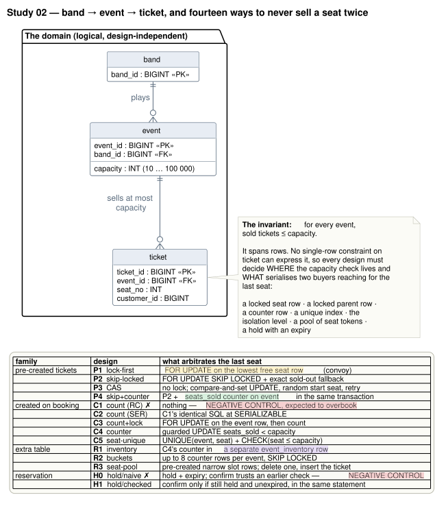

# Study 02 — Avoiding overbooking: band → event → ticket

**Status:** active
**Environment:** [`host-zenbook-ux5406sa`](../../docs/environments/host-zenbook-ux5406sa.md)
**Engines:** PostgreSQL 17.11 · YugabyteDB 2025.2.6.0 (1 node and 3 nodes, RF=3), with real READ COMMITTED
**Code:** the shared [`platform/`](../../platform/) module (measurement core, ports, adapters) + this study's harness

---

## v2 in planning — the reports the back office asks for

The owner asked on 2026-09-15 for the queries and reports a real ticketing operation
needs. [`REPORTS.md`](REPORTS.md) is the protocol: six operational reports added to every
design, the answerability table they produce — **no current design can report refunds,
because cancelling a ticket erases the sale** — and one new design (X1) that adds an
append-only sale ledger to P3 so that it can. No result exists yet.

---

## The question

A show company sells **general-admission** tickets — no buyer chooses a place; see
[Terminology](#terminology-general-admission) — for events of very different sizes and
**must never sell more tickets than an event has seats**:

```
band ──< event (capacity 10 … 100 000) ──< ticket
```

The invariant — *sold tickets ≤ capacity, per event* — spans many rows. No constraint on a
single ticket row can express it, so every design has to decide **where the capacity check
lives** and **what serialises two buyers reaching for the last seat**. That decision is what
this study measures, from the quiet case (demand spread across a catalogue) to the hard one
(a crowd arriving at an unsold event at the same instant).

The owner's starting point: **pre-created tickets** (every seat exists as a row; selling is
an `UPDATE`) versus **creating tickets on booking** (a row appears only when sold) — and, in
some designs, **extra tables** such as reservations. Those are all here, alongside the other
strategies that are actually used for the problem.

### What is measured

| Experiment | What happens | Why |
|---|---|---|
| **Correctness gate** | 5 read questions checked against Go-computed truth + overbooking audit on load | nothing is timed for a design that answers wrongly |
| **Sell-out race** *(headline)* | 32 buyers hit an unsold event at once, per size tier, until "sold out"; an organiser edits the event page throughout | the hot drop is where strategies differ; spread demand hides it |
| **Churn race** | as the race, with 10% of buyers cancelling at once | a design can **under**-sell — say "sold out" with seats empty |
| **Isolated writes** | spread-demand booking, cancellation, publishing an event of each size | the cost of pre-creation outside the race |
| **Reads** | availability per size tier, a band's events, a customer's tickets, point lookup, band sales | what each inventory model does to the questions people ask |
| **Holds** (H0/H1) | hold → basket time → payment → confirm, with abandonment, expiry and a sweeper | the reservation-table flow, and the late-payment overbooking |

After **every** phase that writes, an audit recomputes from each design's own tables:
events over capacity, seats sold twice, derived state (counters, buckets, seat pools, seat
frontiers) that disagrees with the tickets, and a **reconciliation** of the tickets that
exist against the sales the harness saw commit — which catches a sale a buyer was told about
that never persisted.

### Terminology: general admission

This study models **general admission**: a ticket admits one person to an event, and the
only limit is the event's capacity. No design lets a buyer choose a place.

| Term in this study | Means |
|---|---|
| seat | one unit of an event's capacity; any two seats of an event are interchangeable |
| `seat_no` | an **admission number** from 1 to capacity, assigned by the system in the designs that need one (P1–P4, C5, R3); not a physical place. C1–C4, R1 and R2 issue tickets without one |
| overbooking | more tickets than capacity — a limit across many rows, which is why each design has to decide where the check lives |
| hold (`reservation` table, H0/H1) | a claim on one **unit of capacity** for a limited time, not on a particular seat. Its TTL is compressed (250 ms on PostgreSQL, 2.5 s on YugabyteDB) and stands for a checkout of minutes |
| duplicate seat (audit) | an admission number issued twice |

**Reserved seating** — buyers choose specific seats and keep them for a fixed time, such as
40 minutes, while they pay — changes both the invariant and the hard part of the problem. It
is [study 03](../03-reserved-seating/README.md). This note was added after run
`20260913T021206Z` and changes no SQL, harness code, generated report or analysis (tag
`study-02/v1.2-terminology`).

---

## The designs



| ID | Design | What arbitrates the last seat | Diagram |
|---|---|---|---|
| **P1** | precreated-lock-first | `FOR UPDATE` on the lowest free seat row — correct, and a convoy | [P](diagrams/rendered/p_precreated.svg) |
| **P2** | precreated-skip-locked | `FOR UPDATE SKIP LOCKED`, with an exact sold-out fallback | [P](diagrams/rendered/p_precreated.svg) |
| **P3** | precreated-cas | no lock: compare-and-set `UPDATE … AND status='available'`, random start seat | [P](diagrams/rendered/p_precreated.svg) |
| **P4** | precreated-counter | P2 + a `seats_sold` counter on the event row, same transaction | [P](diagrams/rendered/p_precreated.svg) |
| **C1** ✗ | count-naive | nothing: count, then insert, at READ COMMITTED — **negative control** | [C](diagrams/rendered/c_created.svg) |
| **C2** | count-serializable | C1's **byte-identical SQL** at SERIALIZABLE | [C](diagrams/rendered/c_created.svg) |
| **C3** | count-lock-event | `SELECT … FOR UPDATE` on the event row, then count | [C](diagrams/rendered/c_created.svg) |
| **C4** | counter-guard | `UPDATE event SET seats_sold+1 WHERE seats_sold < capacity` | [C](diagrams/rendered/c_created.svg) |
| **C5** | seat-unique | `UNIQUE(event, seat)` + `CHECK(seat ≤ capacity)`; insert seat max+1 | [C](diagrams/rendered/c_created.svg) |
| **R1** | inventory-row | C4's counter moved to a separate `event_inventory` table | [R](diagrams/rendered/r_extra_tables.svg) |
| **R2** | inventory-buckets | up to 8 counter rows per event, taken with SKIP LOCKED | [R](diagrams/rendered/r_extra_tables.svg) |
| **R3** | seat-pool | pre-created narrow `seat_slot` rows; delete one, insert the ticket | [R](diagrams/rendered/r_extra_tables.svg) |
| **H0** ✗ | hold-naive-confirm | reservation with expiry; confirm trusts the pre-payment check — **negative control** | [H](diagrams/rendered/h_holds.svg) |
| **H1** | hold-checked-confirm | confirm only `WHERE status='held' AND expires_at > now()` | [H](diagrams/rendered/h_holds.svg) |

The SQL for each is in [`sql/<design>/`](sql/) — `schema.sql`, `indexes.sql`, `queries.sql`,
`writes.sql`, `audit.sql` — compiled into the benchmark binary. The comments in those files
explain why each design is interesting; they are the design documentation.

### Negative controls

C1 and H0 are in the study **because they are wrong**. A correctness audit that has never
caught a wrong design has not been shown to work — study 01's gate first proved itself by
catching harness bugs. So each control is expected to overbook, and the generated report
states explicitly whether it did. If a control does not fire, the absence of violations in
the other designs of that experiment says only that there was too little contention.

### Controlled pairs

| Pair | Isolates |
|---|---|
| P1 → P2 | SKIP LOCKED, on identical tables |
| P2 → P3 | pessimistic locking read vs optimistic compare-and-set |
| P2 → P4 | a denormalised availability counter — which puts buyers back on one row |
| P4 → C4 | pre-created vs created, with the same counter serialising both |
| **C1 → C2** | **the isolation level alone** (`diff -r` of the SQL is empty) |
| C1 → C3 | locking the parent row |
| C3 → C4 | counting at read time vs a maintained counter, inside the same critical section |
| C4 → C5 | a counter row vs a unique index as the arbiter |
| C4 → R1 | moving the hot counter off the event row |
| R1 → R2 | sharding the counter |
| P2 → R3 | SKIP LOCKED on a wide pre-created ticket vs on a narrow slot plus an insert |
| H0 → H1 | validating the hold at confirmation (one `WHERE` clause) |
| yb-single → yb-cluster3 | adding two more nodes |

C1, C2 and C3 read through byte-identical SQL, so their read differences calibrate the run's
own error bar, as D4/D5 did in study 01.

---

## The dataset

Deterministic from a fixed seed, identical in every cell. Event sizes are the study's tiers:
**10, 100, 1 000, 10 000 and 100 000 seats**.

| Kind | Purpose | `small` scale |
|---|---|---|
| catalogue | 20–60% sold at load; reads, spread booking, cancellation | 400×10, 80×100, 16×1k, 3×10k, 1×100k |
| race | unsold; each sold out by a crowd | 100×10, 20×100, 5×1k, 2×10k, 1×100k |
| churn | unsold; sold out while buyers cancel | 50×10, 10×100, 2×1k |

Tier counts keep each tier's total capacity of the same order, and give the small tiers
enough independent races that a rare overbooking has many chances to show. 40 bands and
20 000 customers, both Zipf-skewed. Loaded sold seats are the lowest-numbered, so every
design — including C5, whose next seat is `max + 1` — starts from the same logical state.

---

## Reproducing it

Podman is the only prerequisite. See [docs/replication.md](../../docs/replication.md).

```bash
./run-study.sh --scale small --tag
```

`--tag` tags the current commit `run/02-ticket-booking/<run-id>` before running (a dirty
working tree is never tagged, and every result records whether the tree was dirty). Each
(topology, design) cell is an independent container run; a failed cell leaves the rest.

```bash
# one slice
./run-study.sh --topologies pg-single --designs c1_count_naive,c2_count_serializable --scale tiny
```

```bash
# repeated races: three fresh-load trials of the race and churn phases only
./run-study.sh --phases verify,race,churn --extra "-race-trials 3"
```

```bash
# regenerate the diagrams
./diagrams/render.sh svg
```

## Results and conclusions

**Start here:** [the signed analysis](reports/analyses/20260913T021206Z--claude-opus-5--2026-09-13.md)
— its TL;DR answers the owner's questions, and a section names where the measurement is weak.

| Report | What it measures | Code |
|---|---|---|
| [20260913T021206Z](reports/20260913T021206Z.md) | `small` matrix: 14 designs × PostgreSQL 1-node, YugabyteDB 1-node, YugabyteDB 3-node; single trial; C2 failed on both YugabyteDB topologies (diagnosed) | tag `run/02-ticket-booking/20260913T021206Z` |

Generated reports (numbers only) are in [`reports/`](reports/); signed analyses (what the
numbers mean, by whom, looking at which data digest) in [`reports/analyses/`](reports/analyses/).
Raw JSON, readable plans for every read **and write** statement, per-cell console logs and
CPU-throttling counters are under `results/<run-id>/`.

## Reading the numbers honestly

1. **Client and databases share eight laptop cores**, under CFS quotas. The report includes
   the client's throttling counters per phase, because a throttled client puts tens of
   milliseconds into tails that belong to no design.
2. **No real network.** The 3-node cluster's consensus round trips cost microseconds here;
   use the RPC counts in the YugabyteDB plans as the portable signal.
3. **The race is closed-loop.** Buyers wait for their answer before trying again, so tail
   latencies are a floor, not an SLO.
4. **Timed-out races measure only part of a sale.** A design that cannot sell a 100 000-seat
   event within the timeout is reported as such, with the share it sold — and the part it
   did not reach is the part where the event was fullest.
