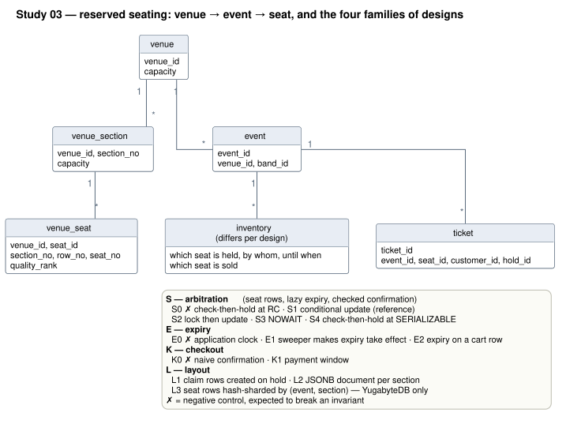

# Study 03 — Reserved seating: choose your seats, keep them for 40 minutes

**venue → event → seat**

**Status:** being built (specification: [Execution Handoff](HANDOFF.md))
**Environment:** [`host-zenbook-ux5406sa`](../../docs/environments/host-zenbook-ux5406sa.md)
**Engines:** PostgreSQL 17.11 · YugabyteDB 2025.2.6.0 (1 node and 3 nodes, RF=3), with real READ COMMITTED
**Code:** the shared [`platform/`](../../platform/) module + this study's harness

---

## The question

A show company sells **reserved seats**: every ticket is for one physical seat — section,
row, number — and **the buyer chooses it on a seat map**. A buyer who has chosen seats keeps
them for **40 minutes** while they finish the purchase, and must never discover, while
paying, that a seat they were holding has gone to someone else.

```
venue ──< section ──< seat
  │
event (at a venue, 10 … 100 000 seats) ──< hold (1–6 adjacent seats, 40 minutes) ──> ticket
```

This is [study 02](../02-ticket-booking/README.md) with marked seats, and marking the seats
moves the hard part of the problem:

- **Overbooking stops being the question.** In general admission (study 02) the invariant
  *sold ≤ capacity* spans many rows, so each design has to decide where the capacity check
  lives. With marked seats, *a seat is sold at most once* is a fact about one row, and a
  primary key or a unique index already enforces it.
- **A promise now lasts 40 minutes.** A hold must keep everyone else off its seats until it
  expires — and then give them back, or seats leak.
- **Two buyers want the same seat, not any seat.** `SKIP LOCKED`, study 02's fastest correct
  strategy, cannot apply: nobody may skip the seat they chose. Conflicts become visible to
  people ("that seat was just taken — choose again").
- **Selections are blocks.** Two to six adjacent seats are held together or not at all.
- **The seat map is the hot read.** Every buyer loads it, often, while holds change it.
- **Expiry and payment race each other**, and **somebody's clock decides** when a hold has
  expired.

### Terminology

| Term | Meaning |
|---|---|
| reserved seating | every ticket is for one physical seat, chosen by the buyer (this study) |
| general admission | tickets are interchangeable units of capacity ([study 02](../02-ticket-booking/README.md#terminology-general-admission)) |
| venue seat | a physical place: venue, section, row, seat number (`venue_seat`) |
| event seat | a venue seat for one event — the unit of inventory |
| block | 1–6 adjacent seats in one row of one section, requested together |
| hold | an exclusive, time-limited claim on a block. The owner's "40-minute reservation" is a hold with a 40-minute TTL. (Study 02's table was called `reservation`; this study says *hold* throughout.) |
| `expires_at` | when a hold ends, judged by the **database clock** unless a design says otherwise (E0) |
| pre-payment check | the buyer's "is my hold still valid?" before paying — friendly, not a guarantee |
| checkout | from pressing *pay* to confirmation; **payment window** (K1 only): a bounded extension granted when checkout starts |
| confirm | turn a valid hold into tickets, atomically for every seat of the block |
| release | a hold ends without a sale: explicitly (the buyer removes the seats) or by expiry |
| steal | a new hold taking a seat whose previous hold has **expired** — legitimate |
| **theft** | a new hold or sale taking a seat whose previous hold had **not** expired — a violation |
| sweeper | background job that garbage-collects expired holds (most designs) or makes expiry take effect (E1) |
| seat map | a section's seats with state available / held / sold, as a buyer sees them |
| honored hold | the owner's guarantee: a confirmation made while the hold is valid succeeds |
| transient refusal | an early rejection where the identical refusing statement, issued again in the same transaction, matched every seat. Seen on YugabyteDB ([ER-01](ESCALATIONS.md)); still a violation of the honored hold |

### Policy — the same in every design

1. A hold covers one block (1–6 adjacent seats, one row, one section): all or nothing.
2. The TTL is **40 minutes** from the grant, by the database clock.
3. A hold has expired when `db_now >= expires_at`. **Strict expiry:** a confirmation after
   expiry is refused even if nobody has taken the seat. A grace policy ("re-acquire it if
   it is still free") is a product decision this study does not measure.
4. A buyer may release a hold explicitly.
5. K1 only: starting checkout while the hold is valid extends it to
   `max(expires_at, now + 10 min)`, once.
6. One price per event; price zones are out of scope.
7. A sold seat can be refunded, which makes it available again.

### Invariants

Every timestamp an invariant uses comes from the database clock and is returned by the
statement that did the work.

| Id | Invariant | Violation |
|---|---|---|
| INV-1 | **No double sale** — at most one ticket per event seat, and no two buyers told they bought the same seat | any duplicate |
| INV-2 | **No theft** — the validity intervals of holds on one seat never overlap | a grant or sale inside another hold's interval |
| INV-3 | **Honored hold** — a confirmation made while the hold is valid succeeds | a rejection at least *G* (2 human minutes) before expiry. Rejections inside *G* are reported as **boundary rejections**, after expiry as **late rejections**. Early rejections are split into **transient** (see terminology) and persistent |
| INV-4 | **No leaked seats** — a seat whose hold ended can be held again | a probe hold refused at quiescence |
| INV-5 | **All or nothing** — holds and confirmations cover exactly their block | a partial hold or sale |
| INV-6 | **No late sale** — a confirmation after expiry never produces tickets | any |
| INV-7 | **Ledger reconciliation** — tickets and valid holds match what the harness saw commit | any unexplained difference |
| INV-8 | **No under-selling** in the race | seats left unsold in an event that did not time out |

### Negative controls

A design numbered **0** is in the study **because it is wrong**. An audit that has never
caught a wrong design has not been shown to work (methodology 5a).

| Control | Proves the detector for | Fires in |
|---|---|---|
| **S0** check, then hold, at READ COMMITTED | theft, early rejection | race, lifecycle |
| **K0** confirm by seat, trusting the pre-payment check | late sale, double sale or theft | lifecycle |
| **E0** expiry judged by an application clock with injected skew | theft, early rejection | lifecycle |
| **E1 during a sweeper outage** (a condition, not a design) | leaked seats | lifecycle |

If a control does not fire on a topology, the absence of violations in the other designs of
that experiment is **not evidence** of their correctness there.

---

## What is measured

| Experiment | What happens | Why |
|---|---|---|
| **Correctness gate** | seat maps, section availability, a hold's seats, tickets — checked against Go-computed truth on a load that contains sold seats, live holds and expired holds | nothing is timed for a design that answers wrongly |
| **Race** *(headline)* | 32 buyers hit an unsold event at once, per size tier. Each reads the seat map, chooses the best block it can see, holds it and confirms; on a conflict it re-reads and chooses again. **10% keep their 40-minute hold until the crowd has gone, then pay — every one must succeed.** A final buyer sells what is left | conflicts over the same seats, and the owner's guarantee under a sell-out storm |
| **Lifecycle** | compressed time (one human minute = 50 ms on PostgreSQL): hold → basket time → abandon, or pre-payment check → (checkout) → payment → confirm. A sweeper runs; it is **stopped for 40 human minutes** in the first event of each tier | expiry, late payments, leaked seats, and the price of the 40-minute promise |
| **Isolated writes** | spread-demand hold + confirm, explicit release, refund, publishing an event of each size | the cost of each inventory layout outside the crowd |
| **Reads** | seat map and availability per size tier, a hold's seats, a customer's tickets, point lookup | what each layout does to the questions buyers ask |

After every phase that writes, an audit recomputes from each design's own tables and
reconciles them with the harness's ledger of what it saw commit.

There is **no organiser editing the event page** during the race, unlike study 02: no design
here writes the `event` row on the booking path, so the edit would measure nothing.

---

## The designs



| Id | Design | Decides | Diagram |
|---|---|---|---|
| **S0** ✗ | check-then-hold-rc | read the seats, then update unconditionally, at READ COMMITTED — **negative control** | [S](diagrams/rendered/s_arbitration.svg) |
| S1 | conditional-update | **the reference:** one conditional multi-row `UPDATE`; fewer rows than seats → roll back. Lazy expiry, checked confirmation | [S](diagrams/rendered/s_arbitration.svg) |
| S1r | confirm-retry | S1, plus: a confirmation that matches fewer seats than the hold is rolled back and run once more, at once, in a new transaction | [K](diagrams/rendered/k_checkout.svg) |
| S2 | lock-then-update | `SELECT … ORDER BY seat_id FOR UPDATE`, then S1's update | [S](diagrams/rendered/s_arbitration.svg) |
| S3 | lock-nowait | S2 with `FOR UPDATE NOWAIT`: fail fast, choose again | [S](diagrams/rendered/s_arbitration.svg) |
| S4 | check-then-hold-serializable | S0's SQL at SERIALIZABLE | [S](diagrams/rendered/s_arbitration.svg) |
| **E0** ✗ | app-clock-expiry | S1 judging expiry by the application's clock — **negative control** (injected skew) | [E](diagrams/rendered/e_expiry.svg) |
| E1 | sweeper-expiry | expiry takes effect only when a sweeper releases the hold | [E](diagrams/rendered/e_expiry.svg) |
| E2 | cart-expiry | expiry stored once on a cart row instead of on every seat | [E](diagrams/rendered/e_expiry.svg) |
| **K0** ✗ | naive-confirm | confirmation updates the seats without checking the hold — **negative control** | [K](diagrams/rendered/k_checkout.svg) |
| K1 | payment-window | starting checkout extends the hold by a bounded payment window | [K](diagrams/rendered/k_checkout.svg) |
| L1 | claim-rows | no per-event seat rows; a claim row is created on hold and a unique index arbitrates | [L](diagrams/rendered/l_layout.svg) |
| L2 | section-document | one JSONB document per event section, updated by version compare-and-set | [L](diagrams/rendered/l_layout.svg) |
| L3 | section-sharded | S1 hash-sharded by (event, section) — **YugabyteDB only** | [L](diagrams/rendered/l_layout.svg) |

The SQL for each is in [`sql/<design>/`](sql/) — `schema.sql`, `indexes.sql`, `queries.sql`,
`writes.sql`, `audit.sql` — compiled into the benchmark binary. Their comments explain why
each design is interesting.

### Controlled pairs

| Pair | Isolates |
|---|---|
| S0 → S4 | the isolation level alone (identical SQL) |
| S4 → S1 | a serializable read-then-write vs one conditional update |
| S1 → S2 | optimistic conditional update vs locking the seats first |
| S2 → S3 | waiting for a seat someone is taking vs failing fast |
| S1 → E1 | expiry judged at use time vs made to take effect by a sweeper |
| S1 → E2 | expiry copied onto every seat vs stored once on the cart |
| E0 → S1 | the application's clock vs the database's |
| K0 → S1 | checking the hold at confirmation |
| S1 → K1 | a guaranteed payment window |
| S1 → L1 | pre-created per-event seat rows vs claims created on hold |
| S1 → L2 | seat rows vs an embedded section document |
| S1 → L3 | (YugabyteDB) one tablet per event vs spread by section |
| S1 → S1r | retrying a short confirmation once, against transient refusals |
| yb-single → yb-cluster3 | adding two nodes — with client connections spread over all three |

`q05` and `q06` read the `ticket` table through byte-identical SQL in twelve designs, which
calibrates the run's own error bar.

---

## The dataset

Deterministic from seed 42, identical in every cell. Size tiers as study 02: **10, 100,
1 000, 10 000 and 100 000 seats**, one venue per tier:

| Tier | Sections × rows × seats per row | Venue |
|---|---|---|
| 10 | 1 × 1 × 10 | back room |
| 100 | 1 × 5 × 20 | club |
| 1 000 | 4 × 10 × 25 | theatre |
| 10 000 | 20 × 20 × 25 | arena |
| 100 000 | 100 × 40 × 25 | stadium |

Seat quality is ranked without randomness: section 1 first, row 1 first, centre of the row
first. Buyers prefer good seats, so conflicts concentrate where they would in reality.

| Kind | Purpose | `small` scale |
|---|---|---|
| catalogue | 20–60% sold (best seats first, with noise), 4% of the rest in live holds, 1% in expired holds | 400×10, 80×100, 16×1k, 3×10k, 1×100k |
| race | unsold; sold out by a crowd | 100×10, 20×100, 5×1k, 2×10k, 1×100k |
| lifecycle | unsold; the hold guarantee under compressed time | 10×10, 10×100, 10×1k |

40 bands and 20 000 customers, both Zipf-skewed, as in study 02.

---

## How study 03 relates to study 02

| Study 02 (general admission) | Study 03 (reserved seating) |
|---|---|
| invariant *sold ≤ capacity*, across many rows | a seat sold at most once — one row; the hard invariants are theft, honored holds and leaks |
| P1/P2 lock the lowest free seat; SKIP LOCKED passes over seats others are taking | a chosen seat cannot be skipped: S2 waits, S3 fails fast, S1 updates conditionally |
| P3 compare-and-set on one seat | S1: the same idea over a block, all or nothing |
| C2 SERIALIZABLE count-then-insert | S4: SERIALIZABLE read-then-update of a block — the conflict set is the block, not the event |
| C5 unique index as the arbiter | L1: unique claim rows, stealing expired claims with an upsert |
| counters on the event row (C4, P4, R1) | none: with lazy expiry an exact availability counter cannot be maintained, because an expiry changes no row |
| H0/H1: hold one unit of capacity for a compressed 250 ms | K0/S1/K1: hold chosen seats for 40 minutes; the race uses real 40-minute holds |
| churn race (under-selling after refunds) | lifecycle (abandoned holds, expiry, sweeper outage) and the race's final single-seat buyer |
| organiser editing the event row | dropped — no design writes it while selling |
| connections to one YugabyteDB node | connections spread over all three nodes |

Numbers from the two studies are **not comparable with each other**: the workloads differ.

---

## Reproducing it

Podman is the only prerequisite. See [docs/replication.md](../../docs/replication.md).

```bash
./run-study.sh --scale small --tag
```

```bash
# one slice
./run-study.sh --topologies pg-single --designs s0_check_then_hold_rc,s4_check_then_hold_serializable --scale tiny
```

```bash
# repeated races: three fresh-load trials of the 1 000- and 10 000-seat races (HANDOFF AM-02.4)
./run-study.sh --scale small --topologies pg-single,yb-cluster3 --phases verify,race --extra "-race-trials 3 -race-tiers 1000,10000" --tag
```

```bash
# regenerate the diagrams
./diagrams/render.sh svg
```

## Results and conclusions

Generated reports hold numbers only. Conclusions belong in signed analyses under
[`reports/analyses/`](reports/analyses/); none yet.

| Run | What | Extra flags and handoff rules | Report | Inputs digest | Notes |
|---|---|---|---|---|---|
| `20260915T002411Z` (tag `run/03-reserved-seating/20260915T002411Z`) | `small`, all phases, pg-single + yb-single + yb-cluster3, 14 designs | YugabyteDB: `-race-tiers 10,100,1000,10000` (AM-02 rule 1: in calibration dc15 the 100 000-seat event sold 2–3% before timing out); nothing else (AM-02 rule 2) | [report](reports/20260915T002411Z.md) | `a56ce92ce38b8204` | 41 cells, 4 failed: S4 and E2 on both YugabyteDB topologies, each diagnosed beside its logs (ER-03). L2's YugabyteDB early rejections are unclassified (ER-04) |
| `20260915T173255Z` (tag `run/03-reserved-seating/20260915T173255Z`) | repeated race: `verify,race`, 3 trials, 1 000- and 10 000-seat tiers, pg-single + yb-cluster3 | `-race-trials 3 -race-tiers 1000,10000` (AM-02.4) | [report](reports/20260915T173255Z.md) | `29296b1fe8dea2e3` | 27 cells, 0 failed; both controls fired. L2's YugabyteDB early rejections are unclassified (ER-04) |
| `20260915T232736Z` (tag `run/03-reserved-seating/20260915T232736Z`) | repair (ER-03): E2 and S4, `verify,lifecycle`, yb-single + yb-cluster3 | none; harness with AM-03's tolerant monitor and `ANALYZE` | [report](reports/20260915T232736Z.md) | `2ccece48793fe693` | 4 cells, 0 failed, no violation: the lifecycle the matrix lost. Later commit than the matrix |
| `20260916T000706Z` (tag `run/03-reserved-seating/20260916T000706Z`) | repair (ER-04): L2, `verify,race`, yb-single + yb-cluster3 | none; harness with AM-03's L2 refusal diagnostic | [report](reports/20260916T000706Z.md) | `903de88de503ded2` | 2 cells, 0 failed; all 17 early rejections on yb-cluster3 classified transient. Later commit than the matrix |

Dev checks, the ER-01 diagnosis and the `small` calibration are under
[`results/devchecks/`](results/devchecks/); their measured facts are in [PROGRESS.md](PROGRESS.md).

## Reading the numbers honestly

1. **Client and databases share eight laptop cores**, under CFS quotas. The report shows
   client and database throttling counters, because a throttled container puts tens of
   milliseconds into tails that belong to no design.
2. **No real network.** The 3-node cluster's consensus round trips cost microseconds here;
   use the RPC counts in the YugabyteDB plans as the portable signal.
3. **Closed loop.** Buyers wait for their answer before trying again, so tail latencies are a
   floor, not an SLO.
4. **Timed-out races measure only part of a sale** — the emptiest part.
5. **The lifecycle runs on compressed time.** Database latency is a far larger share of a
   2-second hold than of a 40-minute one; that is what boundary rejections absorb, and why
   the race uses real 40-minute holds.
6. **E0's clock skew is injected.** On one machine every container reads the same clock;
   E0 shows what judging expiry by an application server's clock does *when* servers
   disagree, as they do across machines.
